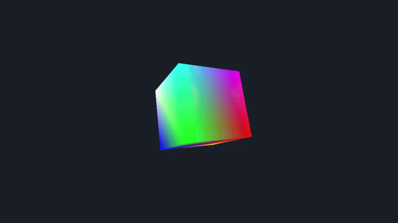

# AxisEngine v0.2.0 — Lightweight 3D Engine Core
---

<p align="center">
  
</p>

> Minimal Java + LWJGL 3 engine core for 3D projects.  
> Designed for clarity, modularity, and easy integration into custom games or visualization tools.

---

## Current Progress
**v0.2.0 (M2 milestone)**  
✅ Window + Loop + Input + Time  
✅ Shader + Mesh + Camera  
✅ Rotating 3D Cube Demo (Depth + Culling)

Next up → MeshBuilder + Renderer abstraction.

---

## Quick Start
```bash
git clone https://github.com/samuelberry-dev/axis-engine
cd axis-engine
./gradlew run
```

## Modules
- `engine.core` — lifecycle, context, config
- `engine.window` — GLFW window wrapper
- `engine.input` — keyboard/mouse
- `engine.time` — delta time + FPS
- `engine.gfx` — shader, mesh, camera
- `engine.demo` — rotating cube showcase

---

## Requirements
- Java 17+
- Gradle 8.9+
- LWJGL 3.3.4
